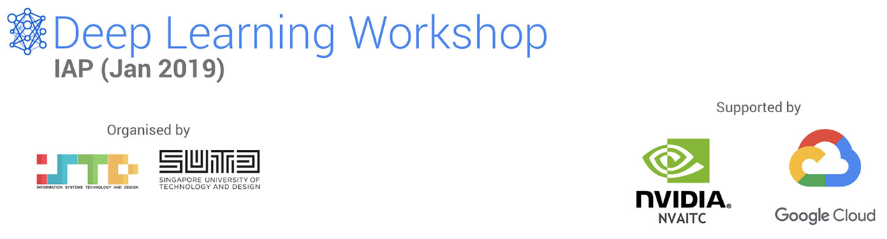
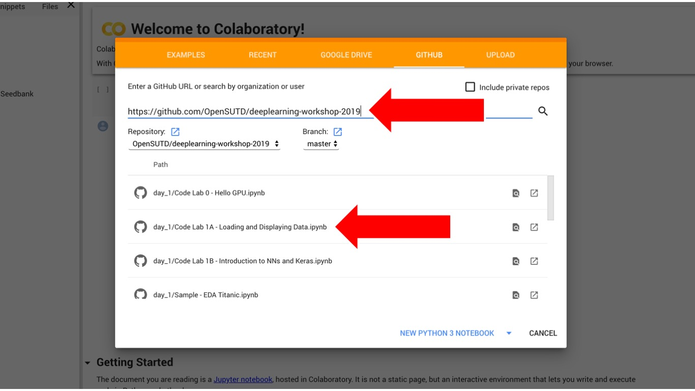

This repository contains the material for the Deep Learning Workshop conducted in the IAP 2019. The slides are also available at on [Google Drive](bit.ly/dl-iap-1) 

If you do not already have a workstation set up for Deep Learning, you may want to run the notebooks in [Google Colab](https://colab.research.google.com/). The instructions are not currently complete, but we will add more information in time.

If you have a workstation or cloud instance set up for Deep Learning, our recommended way to run the notebooks is to run it in a Docker container `nvaitc/ai-lab`. For now, we will also assume that you are using Ubuntu 16.04 or 18.04, and have an NVIDIA GPU card in your workstation/instance. 

 [](https://github.com/OpenSUTD/deeplearning-workshop-2019/issues)

## Using the Notebooks

### A. Google Colab

#### 1. Open Notebook in Colab

1. Proceed to [Google Colab](https://colab.research.google.com) and click the "GitHub" tab.
2. Enter in the URL of this repository as follows and simply select which notebook you wish to open



Note: currently the notebooks do not fully work in Colab.

### B. Workstation / Cloud Instance

#### 1. Setting up CUDA, NVIDIA drivers, and Docker

```bash
sudo su root
curl https://getcuda.ml/ubuntu.sh | bash
# your computer will reboot
# after your computer reboots, add yourself to the docker group
# if you don't want to run docker with sudo
# you may need to log in and out again for this to take effect
sudo usermod -aG docker $USER
```

#### 2. Pulling the `nvaitc/ai-lab` Docker image

* This container includes many data science, machine learning and deep learning packages that are preconfigured and ready to use.
* **This is a 6GB download**!
* Find out more about the image at its [GitHub repository](https://github.com/NVAITC/ai-lab).

```bash
docker pull nvaitc/ai-lab:latest
```

#### 3. Download the code labs

```bash
git clone --depth 1 https://github.com/OpenSUTD/deeplearning-workshop-2019
# take note of where you cloned the files to!
# we will assume it's at /home/USER/deeplearning-workshop-2019
```

Alternatively, you may download this repository as a zip file from the GitHub web interface.

#### 4. Start the container and mount the folder

Please change the path `/home/USER/deeplearning-workshop-2019` to where-ever you downloaded the files to in **Step 3**.

```bash
nvidia-docker run --rm -p 8888:8888 -v /home/USER/deeplearning-workshop-2019:/home/jovyan/ nvaitc/ai-lab
```

This will output a chunk of output in the Terminal. Take note of the last few lines.

Open your web browser and point to `localhost:8888`. You will be asked to enter a token. This can be found in the last few lines of the Terminal output.

## Workshop Authors

* Soh Jun De
* Aiden Chia
* Timothy Liu
